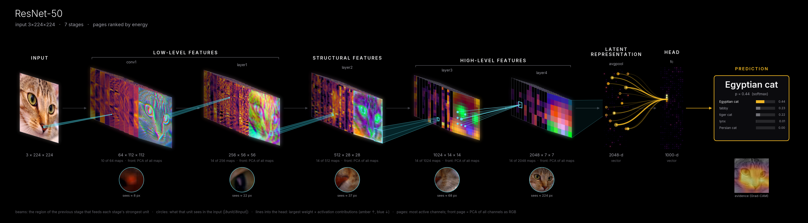
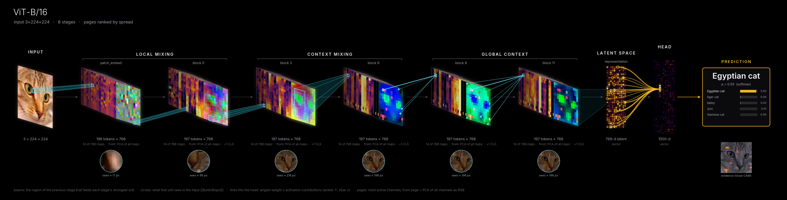
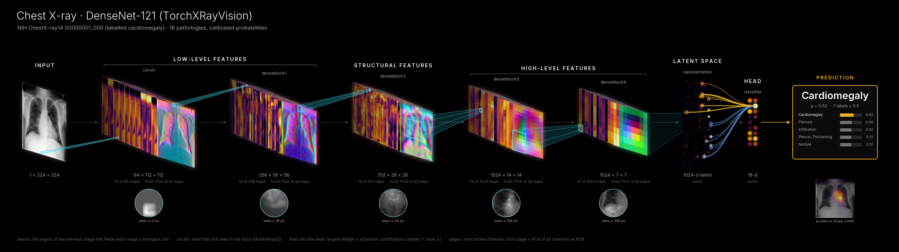
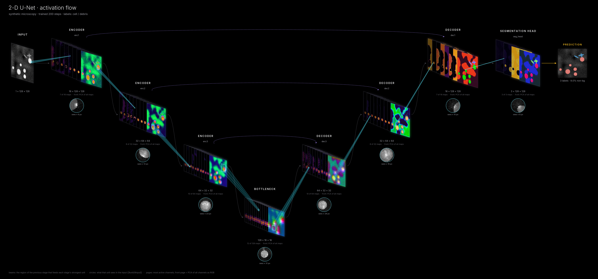
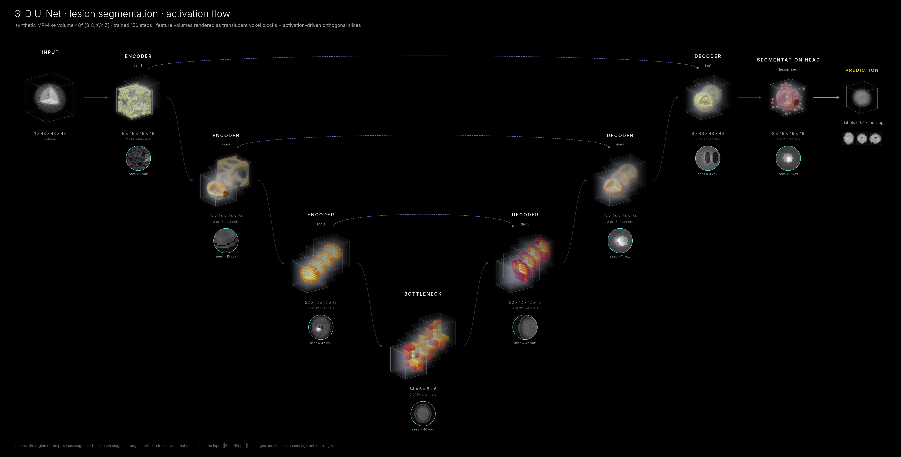
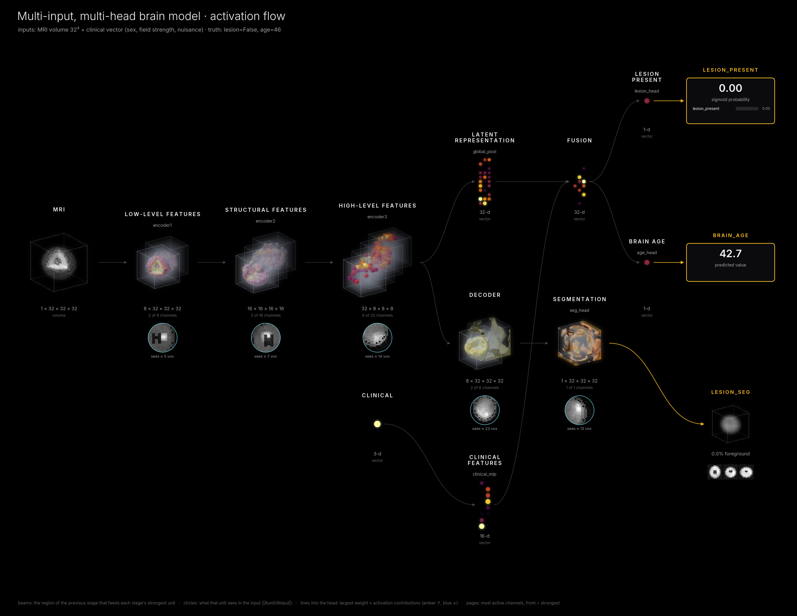
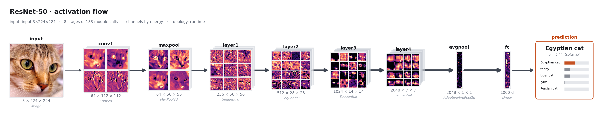
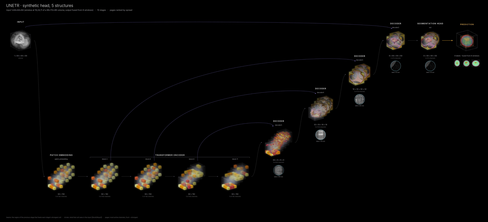
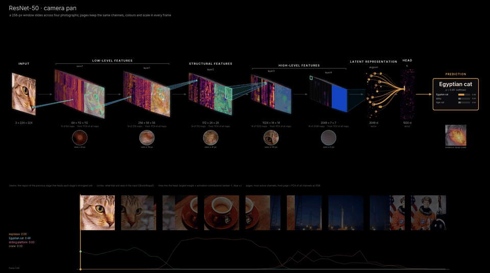
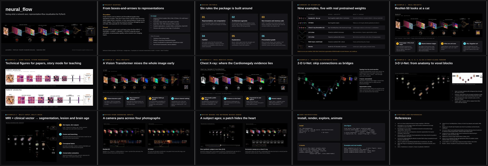

# pymodelvis · `neural_flow`

**See what a PyTorch network sees.** `neural_flow` takes a model and a real input and draws
the path from input to decision. It shows the actual activations at each stage, how the stages
connect, what each stage responds to, and which evidence drives the output. It works with CNNs,
U-Nets, vision transformers, 3-D medical-imaging networks, and multi-input / multi-head models.
It can also render movies of how everything changes as the input changes.

**Website and documentation: https://bennettlandman.github.io/pymodelvis/**

[](https://github.com/BennettLandman/pymodelvis/actions/workflows/tests.yml)


[](LICENSE)
[](https://bennettlandman.github.io/pymodelvis/)



<sub>*ResNet-50 with ImageNet weights, classifying a photograph as "Egyptian cat". Each stage is a stack
of its most active feature maps. The front page is a colour summary (PCA) of all channels in that
layer. Cyan beams mark the part of the previous layer that feeds each layer's strongest unit, and the
circles show what that unit sees in the image (8 px → 224 px). Amber and blue lines mark the latent
units that push the prediction up or down. The heat map under the prediction (Grad-CAM) shows where
the evidence lies.*</sub>

```python
from neural_flow import visualize_model

visualize_model(model, x, output="flow.png", style="cinematic")
```

---

## Contents

- [Why](#why)
- [Gallery](#gallery)
- [Installation](#installation)
- [Command line](#command-line)
- [Quick start (Python)](#quick-start-python)
- [Examples](#examples)
- [Documentation](#documentation)
- [How it works](#how-it-works-in-one-paragraph)
- [Limitations](#limitations)
- [Citing](#citing)
- [About](docs/about.md)
- [License](#license)

## Why

Graph viewers such as Netron draw a network's *operations* as boxes. That is useful for checking
wiring, but it doesn't show what a specific input *becomes* inside the network, which region drove
a decision, or how internal representations change when the input changes. `neural_flow` shows
**representation flow** instead:

```
INPUT → EARLY FEATURES → INTERMEDIATE REPRESENTATIONS → HIGH-LEVEL FEATURES → LATENT → HEAD(S) → OUTPUT
```

* **Automatic.** It picks the 5–12 stages worth showing from arbitrary architectures and folds
  away activations, normalization, dropout and reshapes. You can override any choice.
* **Faithful.** Every pixel comes from the actual input. Outputs are only shown as probabilities
  when they are probabilities, and summarized stages are marked `≈`.
* **Explanatory.** Receptive fields, stage-to-stage dependencies, weight × activation
  contributions and Grad-CAM are computed from gradients for the input you give it.
* **3-D native.** `[B, C, X, Y, Z]` volumes render as anatomy, voxel blocks and
  activation-driven orthogonal slices.
* **Safe.** Hooks are always removed and the model is never modified. Large activations are
  summarized on the GPU within a memory budget.
* **Presentation-grade.** Black cinematic theme, technical and teaching styles, PNG/SVG/PDF,
  an interactive HTML explorer, and movies.

## Gallery

| | |
|---|---|
| **ViT-B/16** (ImageNet weights): every token draws on the whole image by block 4 | **Chest X-ray**, TorchXRayVision DenseNet-121: the Cardiomegaly evidence lies on the heart |
|  |  |
| **2-D U-Net**: skip connections as bridges in a U layout | **3-D U-Net** on an MRI-like volume: anatomy → voxel blocks → lesion |
|  |  |
| **Multi-input, multi-head**: MRI + clinical vector → segmentation, lesion, brain age | **Technical style** for papers (light, exact shapes, module names) |
|  |  |

**3-D transformer networks, whole volumes.** UNETR, Swin UNETR and UNesT show their transformer
levels as stages and their decoder as a U; the output card shows the whole scan fused from sliding
windows, drawn to scale from the voxel spacing ([3-D models](docs/volumes_3d.md)):



**Movies over changing inputs.** Stages, channels, colours and scales stay fixed across frames,
so everything that moves is the network responding:



| movie | what it shows |
|---|---|
| [`movie_pan_resnet.mp4`](examples/outputs/movie_pan_resnet.mp4) | A camera pans across four photos. ResNet-50 goes cat → espresso → drilling platform → go-kart. |
| [`movie_pan_vit.mp4`](examples/outputs/movie_pan_vit.mp4) | The same pan through a vision transformer. |
| [`movie_aging.mp4`](examples/outputs/movie_aging.mp4) | One synthetic subject ages while a lesion grows. Predicted brain age, lesion probability and the 3-D segmentation track it. |
| [`movie_cxr_occlusion.mp4`](examples/outputs/movie_cxr_occlusion.mp4) | A grey patch slides over a chest X-ray. Cardiomegaly drops when the patch covers the heart. |
| [`movie_sliding_window_unetr.mp4`](examples/outputs/movie_sliding_window_unetr.mp4) | 3-D inference: UNETR segments a whole head one window at a time while the fused segmentation assembles. |

**A slide deck made from these outputs.** [`docs/deck/neural_flow_deck.pptx`](docs/deck/neural_flow_deck.pptx)
is a 15-slide PowerPoint deck with the four movies embedded. It shows what the package produces for
a talk. It is generated by [`docs/deck/build_deck.js`](docs/deck/build_deck.js) from the example
outputs, so it can be rebuilt after re-rendering ([instructions](docs/deck/README.md)).



## Installation

```bash
git clone https://github.com/BennettLandman/pymodelvis.git
cd pymodelvis
python -m venv .venv && source .venv/bin/activate
pip install -e .              # core: torch, numpy, matplotlib, pillow, networkx
pip install -e ".[all]"       # + example models, MP4 writer, MONAI/nibabel, pytest
pytest -q                     # CPU tests, about a minute
neural-flow demo cat          # check: writes neural_flow_demos/demo_cat.png
```

Requires Python ≥ 3.9 and PyTorch ≥ 2.1. CPU is enough; a GPU is used automatically if your model
is on one. See [docs/installation.md](docs/installation.md) for the optional extras and for
installing a CPU-only PyTorch.

## Command line

Installing the package adds a `neural-flow` command (also `python -m neural_flow`). You don't need
to write any Python:

```bash
neural-flow demo cat                                        # the ResNet-50 cat figure
neural-flow demo all                                        # every built-in demo, incl. a movie

neural-flow render resnet50 -i photo.jpg -o flow.png --style cinematic
neural-flow render vit -i photo.jpg -o vit.png --theme light --figsize 16 9
neural-flow render cxr -i chest.png -o cxr.png --html      # + interactive explorer

# your own model: a Python file and class, a checkpoint, and an input
neural-flow render my_unet.py:UNet3D --model-args '{"in_ch": 1}' --weights best.pt \
    -i t1.nii.gz --crop 96 --output-type output=segmentation -o unet.png

neural-flow inspect my_net.py:Net --weights best.pt -i random:1,3,224,224 --all-modules
neural-flow render my_net.py:Net --weights best.pt -i x.npy --layers stem,layer2,layer4,head

neural-flow movie resnet50 --pan panorama.jpg -o pan.mp4                  # camera pan
neural-flow movie cxr --occlusion chest.png -o occlusion.mp4             # which region matters?
neural-flow movie resnet50 --crossfade cat.jpg dog.jpg -o morph.mp4
```

Models can be built-in aliases (`resnet50`, `vit`, `swin_t`, `cxr`, `unest`, …), any
`torchvision:NAME` or `timm:NAME`, a MONAI bundle (`monai:DIR`), a whole saved model (`model.pt`),
or `file.py:Class`. Inputs can be images, NIfTI volumes, `.npy`/`.pt` tensors or
`random:SHAPE`. Run `neural-flow <command> --help` for every option. The full walkthrough is in
**[docs/cli.md](docs/cli.md)**.

## Quick start (Python)

```python
import torch, torchvision
from neural_flow import visualize_model

model = torchvision.models.resnet50(weights="IMAGENET1K_V2").eval()
x = torch.randn(1, 3, 224, 224)                       # use a real, normalized image here

visualize_model(model, x, output="flow_technical.png")               # publication figure (default)
visualize_model(model, x, output="flow.png", style="cinematic")      # black, presentation-grade
visualize_model(model, x, output="flow.svg", style="cinematic", theme="light", figsize=(16, 9))
visualize_model(model, x, output="explore.html")                     # interactive explorer
```

Multiple inputs, multiple outputs, 3-D volumes and transformers need no extra code:

```python
visualize_model(model, {"mri": volume, "clinical": features}, style="cinematic")
visualize_model(unet3d, torch.randn(1, 1, 96, 96, 96), output_types={"output": "segmentation"})
```

A movie over changing inputs:

```python
from neural_flow import animate_inputs
from neural_flow.sequences import pan

frames = pan(image_chw, window=256, steps=48, out_size=224)          # [T, C, H, W]
animate_inputs(model, frames, output="pan.mp4", class_names=labels)
```

The [user guide](docs/user_guide.md) covers styles, stage selection, outputs, explanations, 3-D
data and movies. The [API reference](docs/api.md) lists every option.

## Examples

All examples write to `examples/outputs/`. Figures, movies and the demo models' trained weights
(`*.pt`) are committed, so you can look before you run anything.

| script | model | weights | runtime (laptop CPU) |
|---|---|---|---|
| [`examples/resnet.py`](examples/resnet.py) | ResNet-50 on the cat | real (ImageNet) | ~10 s |
| [`examples/vit.py`](examples/vit.py) | ViT-B/16 (`--model swin_t`) | real (ImageNet) | ~15 s |
| [`examples/chest_xray.py`](examples/chest_xray.py) | DenseNet-121 chest X-ray | real (TorchXRayVision) | ~10 s |
| [`examples/unet.py`](examples/unet.py) | 2-D U-Net | trained on synthetic microscopy | ~10 s (2 min first time) |
| [`examples/medical_3d.py`](examples/medical_3d.py) | 3-D U-Net, lesion segmentation | trained on synthetic MRI | ~30 s |
| [`examples/multihead.py`](examples/multihead.py) | MRI + clinical → 3 heads | trained on synthetic data | ~30 s |
| [`examples/transformer_3d.py`](examples/transformer_3d.py) | UNETR / Swin UNETR (MONAI), whole-head segmentation with sliding windows; `--movie`, `--flat` | trained on a synthetic head phantom | ~1.5 min (5–15 min first time) |
| [`examples/movies.py`](examples/movies.py) | pan (ResNet / ViT), ageing subject | as above | 3–8 min each |
| [`examples/monai_bundle.py`](examples/monai_bundle.py) | any MONAI bundle; default **MASI UNesT** whole-brain segmentation (133 structures), sliding windows | real (after `neural-flow fetch unest`) | a few min |
| [`examples/extras.py`](examples/extras.py) | HTML explorer, 16:9 / light / SVG variants, light-up GIF | real | ~1 min |

```bash
bash examples/run_all.sh                 # regenerate everything
neural-flow fetch all                    # fetch ResNet-50, ViT, chest X-ray, UNesT + MNI152 (internet needed)
```

Details for each example: [docs/examples.md](docs/examples.md). Real models and MONAI bundles:
[docs/real_models.md](docs/real_models.md).

## Documentation

| | |
|---|---|
| [Installation](docs/installation.md) | install options, CPU-only PyTorch, optional extras |
| [Command-line guide](docs/cli.md) | `neural-flow demo / render / movie / inspect / fetch`, step by step |
| [User guide](docs/user_guide.md) | concepts and recipes: styles, stages, inputs/outputs, 3-D, transformers, explanations |
| [API reference](docs/api.md) | every public function and every `FlowConfig` option |
| [Examples](docs/examples.md) | what each example shows and how to run it |
| [Movies](docs/movies.md) | `animate_inputs`, input sequences, what is held fixed |
| [3-D models](docs/volumes_3d.md) | voxel spacing, UNETR / Swin UNETR / UNesT, sliding-window output, 3-D inference movies, flat view |
| [Real models](docs/real_models.md) | checkout script, MONAI bundles, UNesT |
| [Cinematic style](docs/cinematic.md) | the visual language and the maths behind beams, circles and lines |
| [Stage selection](docs/stage_selection.md) | how the 5–12 stages are chosen |
| [Tensor rendering](docs/tensor_rendering.md) | how 2-D, 3-D, token, vector and attention tensors become pictures |
| [Topology](docs/topology.md) | hooks, runtime dataflow tracing, `torch.fx` findings |
| [Architecture](docs/architecture.md) | package layout and data flow for contributors |
| [Troubleshooting](docs/troubleshooting.md) | common problems and fixes |
| [References](docs/references.md) | papers behind every demo model and method |
| [About](docs/about.md) | why this project exists and how it was built (with Claude, `claude-opus-5-5`) |

## How it works (in one paragraph)

A light **metadata pass** runs the model once with hooks on every module, while a
`TorchFunctionMode` records the runtime dataflow graph. **Stage selection** then cuts the module
tree into a handful of stages, and **topology** recovers skips, merges and branches from the
dataflow. A **capture pass** hooks only the selected stages and reduces each activation on its own
device: channel rankings, retained maps, PCA, and energy maps. Optionally, one **gradient pass**
computes receptive fields, dependencies, contributions and Grad-CAM. **Renderers** (technical,
story, cinematic) lay out the stage graph and draw it with matplotlib. See
[docs/architecture.md](docs/architecture.md).

## Limitations

* Runtime topology relies on ops passing through `__torch_function__`. TorchScript or compiled
  modules fall back to execution order.
* Stage selection is heuristic. Use `layers=[...]` and `labels={...}` for unusual architectures.
* Explanations need a differentiable forward pass; non-differentiable stages are skipped.
* 3-D rendering is a CPU ray-caster (~0.3–1 s per channel volume), so 3-D movies take a few
  seconds per frame.
* The U-Net, 3-D U-Net and multi-head demo models were trained briefly on synthetic data. They
  demonstrate the tool, not clinical performance.

## Citing

If `neural_flow` helps your work, please cite it with the metadata in [CITATION.cff](CITATION.cff)
(GitHub's "Cite this repository" button uses it). Please also cite the methods and models behind
the figures you use; see the [references](docs/references.md).

## License

BSD 3-Clause, see [LICENSE](LICENSE). Bundled third-party assets (the Inter typeface under the SIL
Open Font License and a CC0 sample photograph) and models used by the examples are listed in
[THIRD_PARTY_NOTICES.md](THIRD_PARTY_NOTICES.md).

Developed at the [MASI Lab](https://my.vanderbilt.edu/masi) and
[VALIANT](https://www.vanderbilt.edu/valiant), Vanderbilt University.
