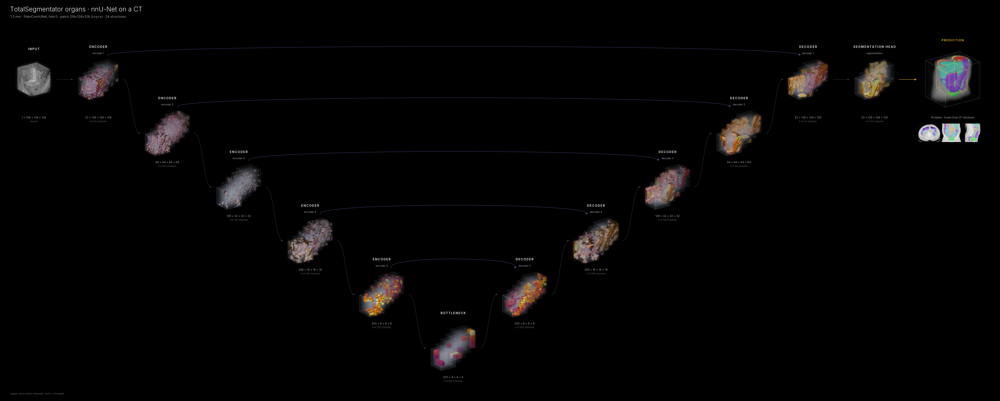

# nnU-Net and TotalSegmentator

`neural_flow` draws [nnU-Net](https://github.com/MIC-DKFZ/nnUNet) v2 networks level by level and
loads *trained* nnU-Net models straight from their results folders, with nnU-Net's own
preprocessing, patch size, spacing and sliding-window settings. nnU-Net itself does not need to be
installed; only the small `dynamic-network-architectures` package that nnU-Net builds its networks
with.

The worked example is [TotalSegmentator](https://github.com/wasserth/TotalSegmentator), whose public
CT models are ordinary nnU-Net results folders.



*TotalSegmentator's 1.5 mm organ model (nnU-Net `PlainConvUNet`, 6 resolution levels, 24 structures) on
its public example CT. Each encoder level bridges to the decoder level of the same resolution. The
stages show one 128³ window; the output card is the whole CT fused from all 27 windows (the traced
window is outlined), drawn to scale.*

## Quick start

```bash
pip install dynamic-network-architectures nibabel scipy     # or: pip install -e ".[medical]"
neural-flow fetch totalseg                                   # 3 mm model (≈135 MB) + example CT
neural-flow render totalseg -i sample:ct --sliding-window --style cinematic -o totalseg.png

neural-flow fetch totalseg-organs                            # 1.5 mm organ model (≈235 MB)
neural-flow render totalseg-organs -i sample:ct --sliding-window --style cinematic -o organs.png
neural-flow movie totalseg-organs --inference sample:ct -o organs_inference.mp4   # window by window
```

Your own trained model: point at its results folder, optionally with a fold (default 0):

```bash
neural-flow render nnunet:$nnUNet_results/Dataset123_Liver/nnUNetTrainer__nnUNetPlans__3d_fullres \
    -i case_0001.nii.gz --sliding-window --style cinematic
neural-flow render nnunet:$nnUNet_results/Dataset123_Liver:2 -i case.nii.gz --sliding-window   # fold 2, 3d_fullres picked
neural-flow inspect nnunet:$nnUNet_results/Dataset123_Liver -i case.nii.gz                   # the stages only
```

`examples/nnunet_totalseg.py` does the same in Python (both TotalSegmentator figures, `--movie`, and
`--results DIR --image CASE` for your models).

## What the figure shows

nnU-Net keeps each half of its U-Net in parallel lists that run interleaved:
`encoder.stages[i]`, and `decoder.transpconvs[s]` → concatenation with the skip →
`decoder.stages[s]` → `decoder.seg_layers[s]`. The generic stage selection ran out of room inside those
lists (upsampling layers but no decoder convolutions). The nnU-Net adapter recognises the layout by
structure (no class names) and shows one stage per resolution level:

| stage | module | concept |
|---|---|---|
| `stem` | `encoder.stem` (residual encoders only) | STEM |
| `encoder 1 … n-1` | `encoder.stages[0 … n-2]` | ENCODER |
| `bottleneck` | `encoder.stages[n-1]` (lowest resolution) | BOTTLENECK |
| `decoder n-1 … 1` | `decoder.stages[0 … n-2]`; the transposed convolution and the skip concatenation that feed it are folded into its incoming edges | DECODER |
| `segmentation` | the last `decoder.seg_layers` (full resolution) | SEGMENTATION HEAD |

Decoder `k` rebuilds the resolution of encoder `k`, and the skip bridge joins the two. This works for
`PlainConvUNet`, `ResidualEncoderUNet` (the nnU-Net ResEnc M/L/XL presets) and any other network
with the same layout; `neural-flow inspect` prints the stages and skip edges it found.

**Deep supervision.** Networks built for training return a list of predictions, one per decoder
level. As at nnU-Net inference, `neural_flow` sets `deep_supervision = False` while it runs the model
(and restores it afterwards), so only the full-resolution prediction is drawn. `aux_outputs=True` keeps
the auxiliary outputs.

## Loading a results folder

`nnunet:DIR[:FOLD]` (or `neural_flow.nnunet.load_nnunet(DIR)` in Python) accepts the
`Trainer__Plans__configuration` folder or its `DatasetXXX_Name` parent (`3d_fullres` is preferred,
then `3d_cascade_fullres`, `3d_lowres`). It:

1. rebuilds the network from `plans.json` with `dynamic_network_architectures`, for the current plans
   format (`architecture` block) and the older one (`UNet_class_name`, used by TotalSegmentator v2);
2. loads `fold_N/checkpoint_final.pth` (else `checkpoint_best.pth`), with deep supervision off;
3. takes the class names from `dataset.json` (region-based models are loaded too; their outputs are
   independent sigmoid regions);
4. attaches nnU-Net's preprocessing and inference settings:

| step | nnU-Net | `neural_flow` |
|---|---|---|
| reading | `NibabelIOWithReorient` / SimpleITK: RAS, axes reversed to `[z, y, x]` | the same; the figure uses `volume_axes="zyx"` |
| cropping | to the non-zero bounding box | the same (without hole filling) |
| normalisation | per channel from the plans (`CTNormalization`: clip to the 0.5–99.5 % foreground percentiles, then z-score with the dataset's mean and std; `ZScoreNormalization` …) | the same schemes |
| resampling | to the plans' spacing, cubic spline, separate z for very anisotropic scans | cubic spline via SciPy (trilinear without SciPy), no separate z |
| sliding window | plans' patch size, step 0.5, Gaussian σ = patch/8 | the same (`--sliding-window` uses them automatically) |
| test-time mirroring, fold ensembles | on by default | not used (one fold, one pass) |
| export | back to the original geometry | the prediction stays in the network's space |

The spacing drawn is the plans' target spacing, so the volumes have true proportions.

**Checked against TotalSegmentator.** On the example CT, the 3 mm model loaded this way agrees with
TotalSegmentator's own reference segmentation: Dice 0.95–0.98 for spleen, kidneys, liver and stomach,
and 97.7 % of the voxels identical. The reference was computed on a 30-slice crop of the same CT
(`example_ct_sm.nii.gz`), so some differences near the crop edges are expected. `tests/test_nnunet.py`
repeats this check whenever the weights are present.

## Python

```python
from neural_flow import visualize_model, zoo

lm = zoo.load_model("nnunet:/path/to/Dataset123_Liver/nnUNetTrainer__nnUNetPlans__3d_fullres")
info = {}
x = zoo.load_input("case.nii.gz", lm, info=info, whole=True)        # preprocessed [1, C, z, y, x]
visualize_model(lm.model, x, style="cinematic", sliding_window=True, roi_size=lm.roi,
                sw_overlap=lm.sw_overlap, volume_axes=lm.volume_axes, voxel_spacing=info["spacing"],
                class_names=lm.class_names, output_types={"output": "segmentation"}, output="liver.png")
```

A network you build yourself (for example `nnUNetTrainer.build_network_architecture(...)` or
`get_network_from_plans(...)`) needs nothing special: pass it to `visualize_model` and the adapter
does the rest.

## Memory and time

The gradient explanations (the receptive-field circles and beams) need one backward pass through a
whole patch. For nnU-Net's large 3-D patches this is several GB (`neural_flow` estimates about 5 GB for
TotalSegmentator's 112×112×128 patch and 6 GB for 128³). It estimates the need first and skips the
explanations with a note when they would not fit in 80 % of the free memory; on a machine with more
memory, `--set explain_max_mb=16000` forces them, and `--no-explain` always skips them. (The 3 mm gallery
figure has explanations, forced with `python examples/nnunet_totalseg.py --model totalseg --explain-max-mb 7000`;
the 1.5 mm one was rendered on an 8 GB machine without them.) The forward passes are light: on a laptop CPU the 3 mm figure takes about
two minutes and the 1.5 mm organ figure (27 windows) about six.

## References

Isensee et al., *nnU-Net*, Nature Methods 2021; Isensee et al., *nnU-Net revisited*, MICCAI 2024;
Wasserthal et al., *TotalSegmentator*, Radiology: Artificial Intelligence 2023. Full entries:
[References](references.md).
