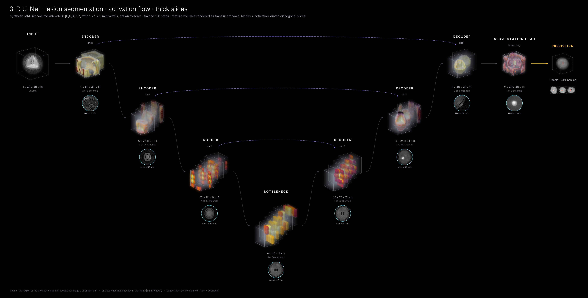
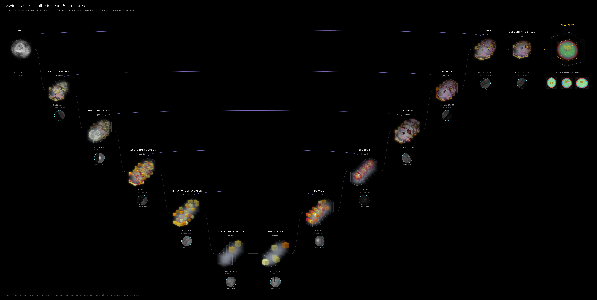
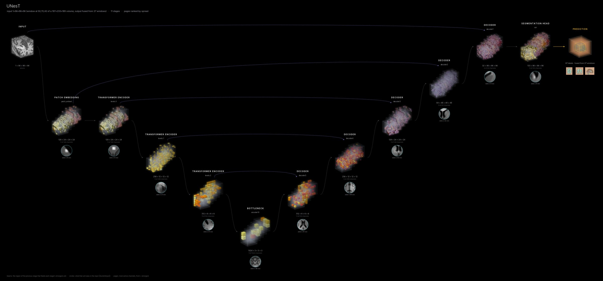
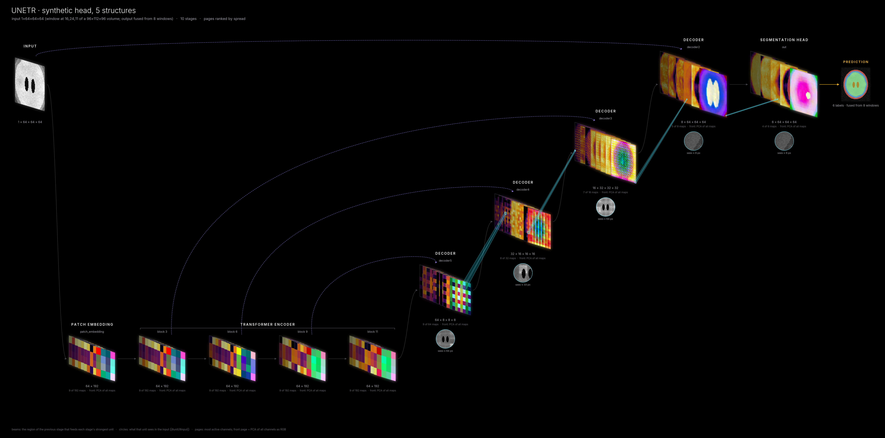

# 3-D models

`neural_flow` treats `[B, C, X, Y, Z]` volumes as first-class objects. This page covers what is
specific to volumetric networks: axis order, voxel spacing, transformer U-Nets such as UNETR, Swin
UNETR and UNesT, whole-volume (sliding-window) inference, the optional flat 2-D view, and movies of 3-D
inference.


*UNETR (MONAI) trained on synthetic heads. The 12-block transformer is shown as its four tapped blocks
on a 4³ token grid, the decoder climbs back to 64³, and the output card shows the whole head fused from
every 64³ window (the traced window is outlined).*

## Axis order

| `volume_axes` | tensor layout | used by |
|---|---|---|
| `"xyz"` (default) | `[B, C, X, Y, Z]`, x = left→right, y = posterior→anterior, z = inferior→superior | nibabel, MONAI `LoadImage` |
| `"zyx"` | `[B, C, Z, Y, X]`, the same axes reversed | nnU-Net, SimpleITK (set automatically for `nnunet:` models) |
| `"dhw"` | `[B, C, D, H, W]`, a stack of axial slices | torch / DICOM slice stacks |

The axis order only affects how volumes are drawn (which way is "up"), never the model.

## Voxel spacing

Scans are rarely isotropic. With the spacing, every volume is drawn with its real proportions, and the
input and all of its feature maps cover the same physical field of view:

```python
visualize_model(model, x, voxel_spacing=(1.0, 1.0, 3.0))       # mm per voxel, tensor axis order
```

```bash
neural-flow render my_unet.py:UNet --weights w.pt -i scan.nii.gz     # spacing read from the NIfTI header
neural-flow render my_unet.py:UNet --weights w.pt -i scan.nii.gz --spacing 0.8 0.8 5
neural-flow render my_unet.py:UNet --weights w.pt -i scan.nii.gz --no-spacing   # cubes, as before
```



*The 3-D U-Net on a thick-slice (1 × 1 × 3 mm) volume. Without the spacing the head would be drawn
squashed to a third of its height.*

## Transformer U-Nets (UNETR, Swin UNETR, UNesT, …)

These networks run a transformer *backbone* over the image, tap its hidden states at several depths,
and feed each tap into the decoder level with the matching resolution. `neural_flow` recognises the
pattern from the runtime dataflow (no model names are hard-coded) and shows:

| role | UNETR | Swin UNETR | UNesT |
|---|---|---|---|
| patch embedding | `vit.patch_embedding` | `swinViT.patch_embed` | `nestViT.patch_embed` |
| transformer encoder | blocks 3, 6, 9, 12 (one token grid) | the four Swin levels (resolution halves, channels double) | the three NesT levels |
| bottleneck | – | `encoder10` | `encoder10` |
| decoder | `decoder5 … decoder2` | `decoder5 … decoder1` | `decoder5 … decoder1` |
| head | `out` | `out` | `out` |

The small convolutional branches that only resample a hidden state for its decoder level (UNETR's
`encoder2..4`) are drawn as skip bridges from the transformer level to the decoder instead of as stages
of their own. `neural-flow inspect MODEL -i INPUT` prints the chosen stages and the skip edges; to show
the branches too, list them explicitly:

```bash
neural-flow render unetr.py:build --layers "re:^vit\.blocks\.(3|6|9|11)$,encoder2,encoder3,decoder5,decoder2,out" -i x.nii.gz
```



*Swin UNETR on the same head: the four Swin levels halve the resolution (16³ → 2³) while the decoder
climbs back to 64³.*



*Structure check for MASI's UNesT on the MNI152 template (197 × 233 × 189, 27 windows), built from the
MONAI bundle's own sources **with random weights**: the patch embedding, three NesT levels, bottleneck
and decoder are found and drawn as a U. The prediction is meaningless without the trained weights;
run `neural-flow fetch unest` and `bash tools/test_unest.sh` to render it with them.*

## nnU-Net

nnU-Net's U-Nets (`PlainConvUNet`, `ResidualEncoderUNet`) are drawn one stage per resolution level,
with deep supervision switched off, and trained models load from their results folders with nnU-Net's
own preprocessing and sliding-window settings:

```bash
neural-flow render totalseg -i sample:ct --sliding-window --style cinematic          # TotalSegmentator, CT
neural-flow render nnunet:/path/to/results_folder -i case.nii.gz --sliding-window    # your model
```

See [nnU-Net and TotalSegmentator](nnunet.md).

## Whole-volume output (sliding windows)

3-D segmentation networks are trained on a fixed window (e.g. 96³) and applied to a whole scan with
sliding-window inference: overlapping windows are run one at a time and blended with a Gaussian
weight. `sliding_window=True` shows both sides honestly:

* the **stages** show the one window the network actually processed (centred on the foreground, or at
  `roi_center`);
* the **output card** shows the prediction fused from every window over the whole volume, with the
  traced window outlined.

```python
visualize_model(model, whole_volume, sliding_window=True, roi_size=(96, 96, 96), sw_overlap=0.25,
                voxel_spacing=(1, 1, 1), output_types={"output": "segmentation"})
```

```bash
neural-flow render unest -i T1_mni.nii.gz --sliding-window --style cinematic
neural-flow render my_net.py:Net -i ct.nii.gz --sliding-window --roi 128 128 64 --sw-overlap 0.5
```

Fusion needs no MONAI (`neural_flow.volume3d.sliding_window_infer`). For many-class models (UNesT has
133 structures) the fused logits of a whole head would take several GB, so they are accumulated on a
coarser grid when they would exceed `sw_max_mb` (1.5 GB by default); a warning says so.

## Movie: 3-D inference, window by window

```python
from neural_flow.volume3d import sliding_window_movie

sliding_window_movie(model, whole_volume, (96, 96, 96), "inference.mp4", overlap=0.25, max_windows=16,
                     voxel_spacing=(1, 1, 1), output_types={"output": "segmentation"})
```

```bash
neural-flow movie unest --inference T1_mni.nii.gz --max-windows 16 -o unest_inference.mp4
python examples/transformer_3d.py --movie
```

Each frame is one window. The stages follow the window through the head (stages, channels and colour
scales are fixed across frames, as in every movie), the output card shows the segmentation assembling
as windows are fused, and the film strip shows where the window is.

[movie_sliding_window_unetr.mp4](../examples/outputs/movie_sliding_window_unetr.mp4)

## Optional: flat 2-D view

To draw a volumetric network like a 2-D CNN (for example for a slide that sits next to 2-D models),
squash every 3-D stage into a 2-D projection. It is off by default because it hides depth.

```python
visualize_model(model, x, flat_3d=True)          # max projection; flat_3d="mean" for a mean projection
```

```bash
neural-flow render my_unet.py:UNet -i scan.nii.gz --flat-3d
```

Feature maps, receptive fields and Grad-CAM are projected along the inferior–superior axis; the input
and the segmentation are shown as the axial slice through the input's centre of mass, so the anatomy
stays legible.



## Other 3-D options

| option | what it does |
|---|---|
| `volume_mode="volume"` (default for features) | translucent voxel blocks, strongest activations solid |
| `volume_mode="ortho"` / `"montage"` / `"projection"` | orthogonal slices / most active axial slices / max-projections, as 2-D tiles |
| `volume_style="voxels" \| "cutaway" \| "glow"` | how 3-D blocks are rendered |
| `max_spatial_3d` | largest captured feature volume per axis (default 48; larger ones are downsampled on the device) |
| `max_input_3d` | largest input volume kept for drawing (default 128) |

## Performance

A 96³ window of UNesT or Swin UNETR takes seconds on a GPU and about a minute on a laptop CPU,
including the gradient explanations (`explain=False` / `--no-explain` roughly halves that). Sliding-window
output costs one forward pass per window: a whole MNI-space head at 96³ with 25 % overlap is 27 windows.
Movies re-run the network three times per frame (stage choice, channel ranking, capture), so use
`max_windows` and a GPU for long ones.

## References

UNETR (Hatamizadeh et al., WACV 2022), Swin UNETR (Hatamizadeh et al., BrainLes 2021; Tang et al., CVPR
2022), UNesT (Yu et al., Medical Image Analysis 2023), NesT (Zhang et al., AAAI 2022), Gaussian
sliding-window fusion and nnU-Net (Isensee et al., Nature Methods 2021), TotalSegmentator (Wasserthal et al.,
Radiology: AI 2023). Full entries: [References](references.md).
